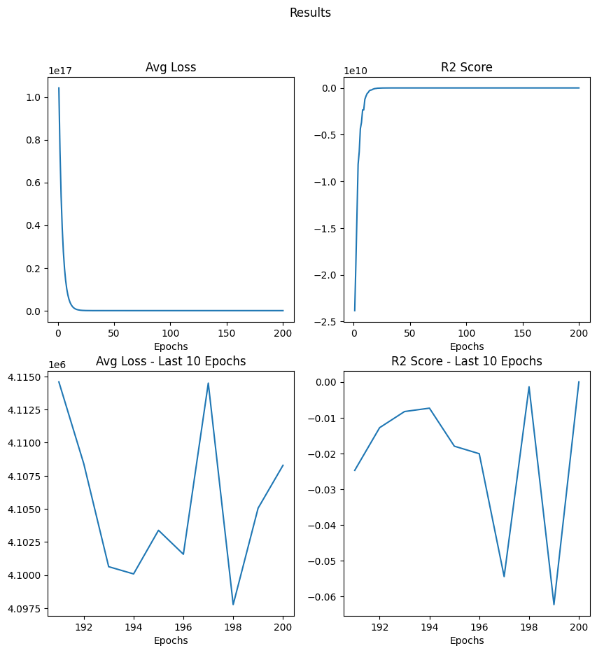
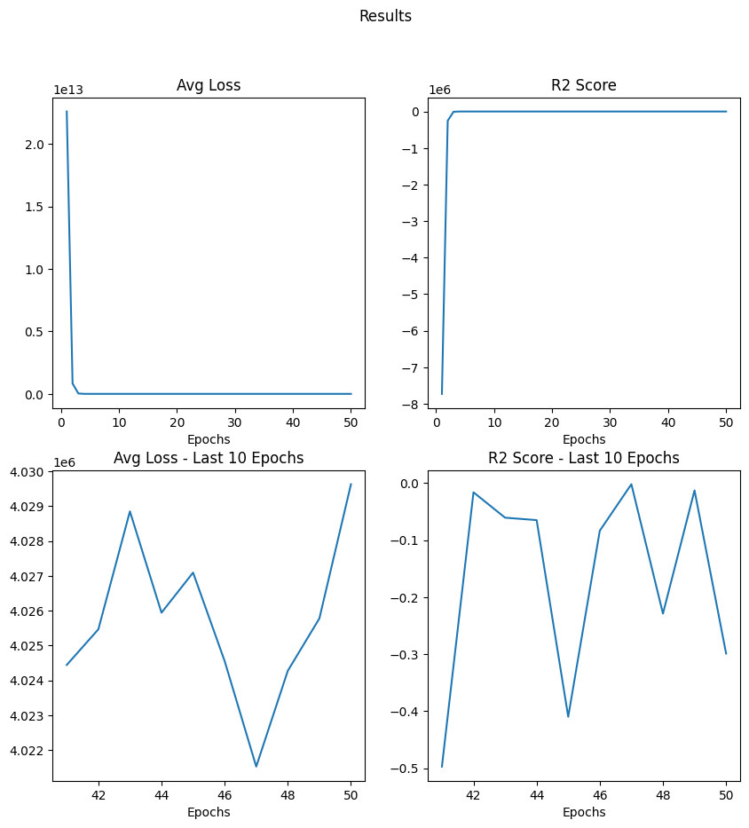
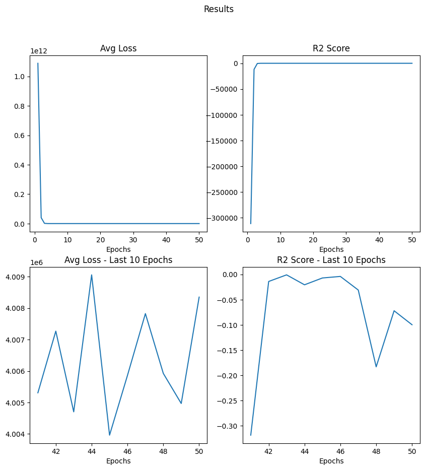
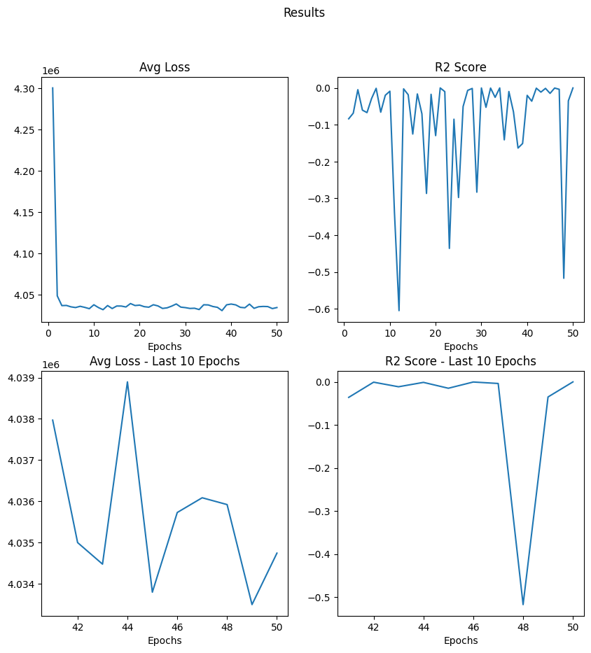
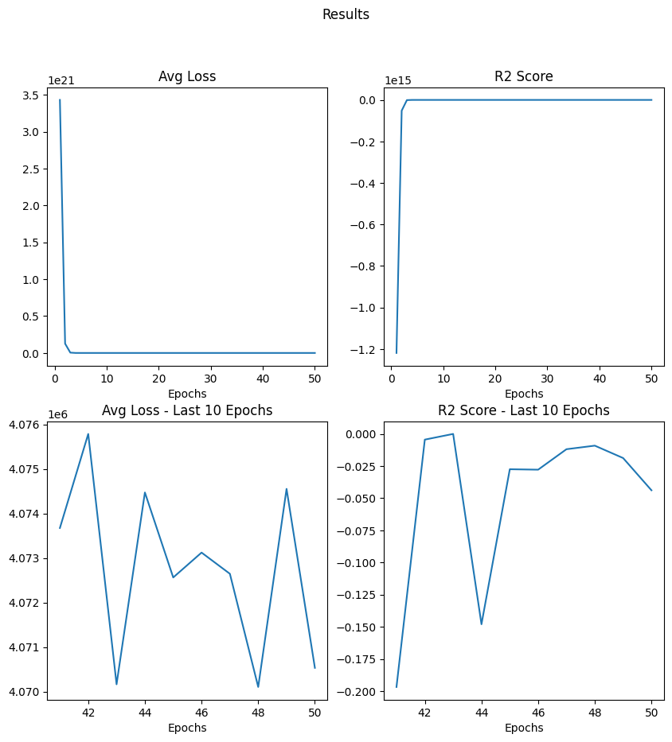
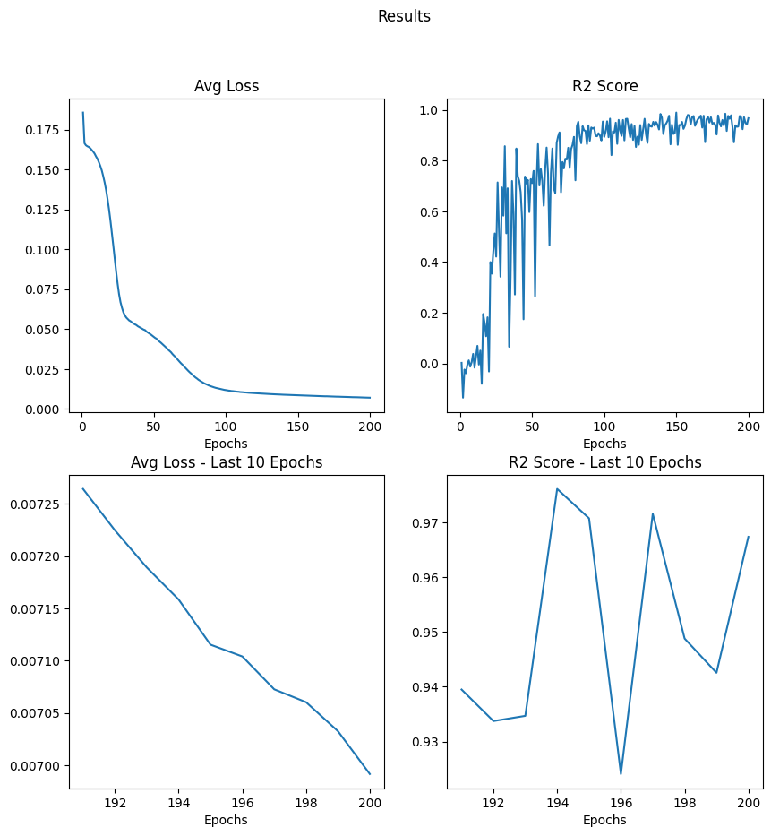

# Report on Current NN Progress

## Preprocess Dataset

Use min-max scaling for easier data processing

Choose `n_bins = 8` to form a `8 * 8` 2D histogram. And for every two columns, we randomly generate `n_queries = 100` quries as samples.

As a result, for a 11-column table, there will be 6600 samples.

## Model

Use a three-layer MLPs.

```
NeuralNetwork(
  (MLPs): Sequential(
    (0): Linear(in_features=68, out_features=128, bias=True)
    (1): ReLU()
    (2): Linear(in_features=128, out_features=128, bias=True)
    (3): ReLU()
    (4): Linear(in_features=128, out_features=5, bias=True)
    (5): ReLU()
    (6): Linear(in_features=5, out_features=1, bias=True)
  )
)
```
## Result

### Using the original model

The results indicates that the model behaves random and connot learn the pattern anymore.



### Attempt 1: let `n_queries = 1000`

Adding more samples does not improve the model.



### Attempt 2: enlarge the hidder layer

Enlarge the hidden layer size from 128 to 256:

```
NeuralNetwork(
  (MLPs): Sequential(
    (0): Linear(in_features=68, out_features=256, bias=True)
    (1): ReLU()
    (2): Linear(in_features=256, out_features=256, bias=True)
    (3): ReLU()
    (4): Linear(in_features=256, out_features=5, bias=True)
    (5): ReLU()
    (6): Linear(in_features=5, out_features=1, bias=True)
  )
)
```

And still cannot improve the results.



### Attempt 3: reduce hidden layer

With 1 hidden layers:

```
NeuralNetwork(
  (MLPs): Sequential(
    (0): Linear(in_features=68, out_features=128, bias=True)
    (1): ReLU()
    (2): Linear(in_features=128, out_features=5, bias=True)
    (3): ReLU()
    (4): Linear(in_features=5, out_features=1, bias=True)
  )
)
```



With no hidden layer:

```
NeuralNetwork(
  (MLPs): Sequential(
    (0): Linear(in_features=68, out_features=128, bias=True)
    (1): ReLU()
    (2): Linear(in_features=128, out_features=1, bias=True)
  )
)
```



The results indicates that our model is no better than linear model.

### Attemp4: using normalization

normalization effectively improves r2-score. 



However, to make prediction, we must make linear tranformation $y_{pred} = ky_{model} + b$ where $k$ and $b$ relies on the knowledge of table. This makes the model table-specific.