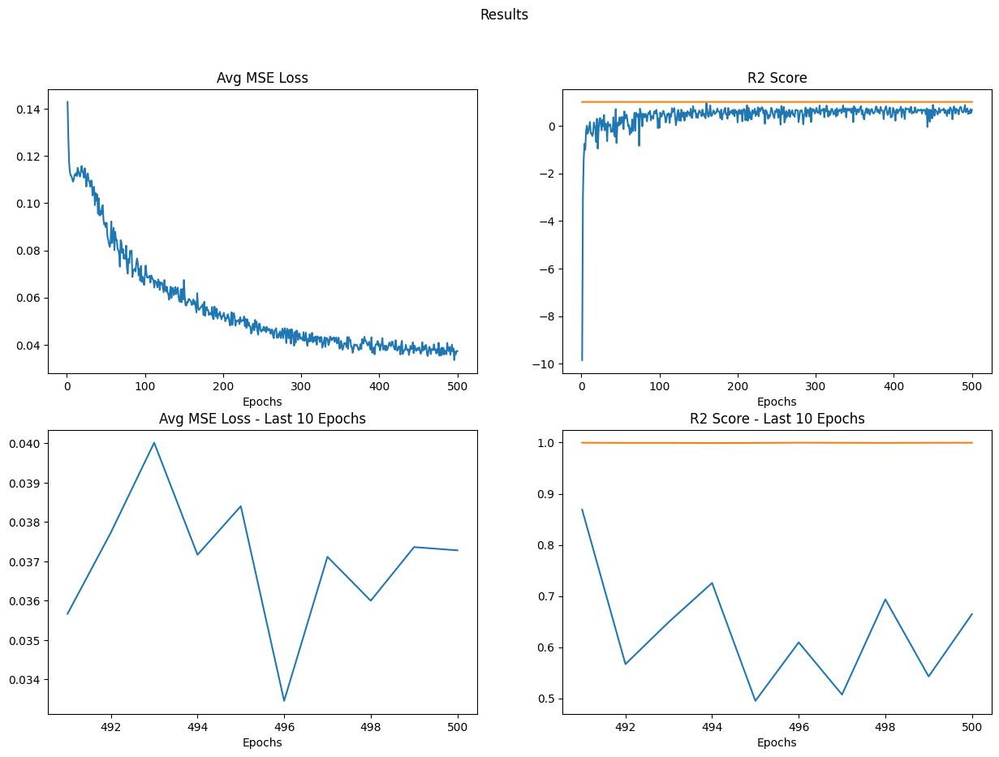

# Report on resent progress

## Tests on random generated dataset

Which indicates that our model is not general.

## Including gradient in loss function 

The original loss function: (where $\hat y$ is the predicted answer)

$$
\mathcal L (\hat y, y) = \mathrm {MSE} (\hat y, y) = \frac{1}{n}\sum_{i = 1}^n \left( Y_i - \hat Y_i \right)^2
$$

The proposed loss function including gradient:

$$
\begin{align}
\mathcal L_{\nabla} = \mathrm{MSE}(\nabla \hat x, \nabla x) \\
\mathcal L_{New} = \alpha \mathcal L + (1 - \alpha) \mathcal L_{\nabla}
\end{align}
$$

Where $\nabla \hat x$ is computed by `torch.autograd.grad` and $\nabla x$ is simply computed according to prefix-sum algorithm.

How to do this is still in progress, for the computating prefix-sum gradient cannot be added to the computation graph, thus cannot be autograded.