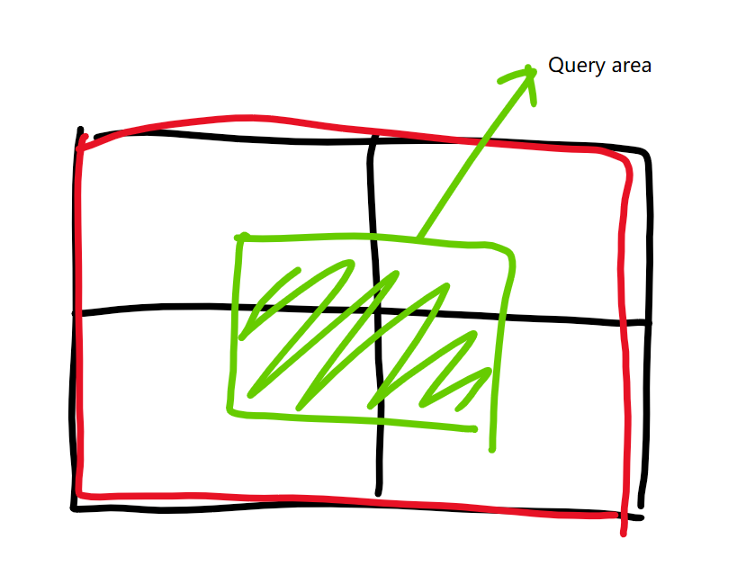
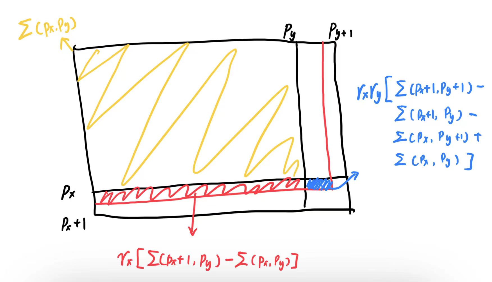
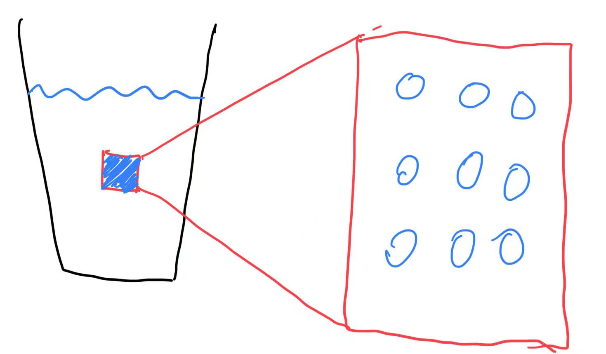
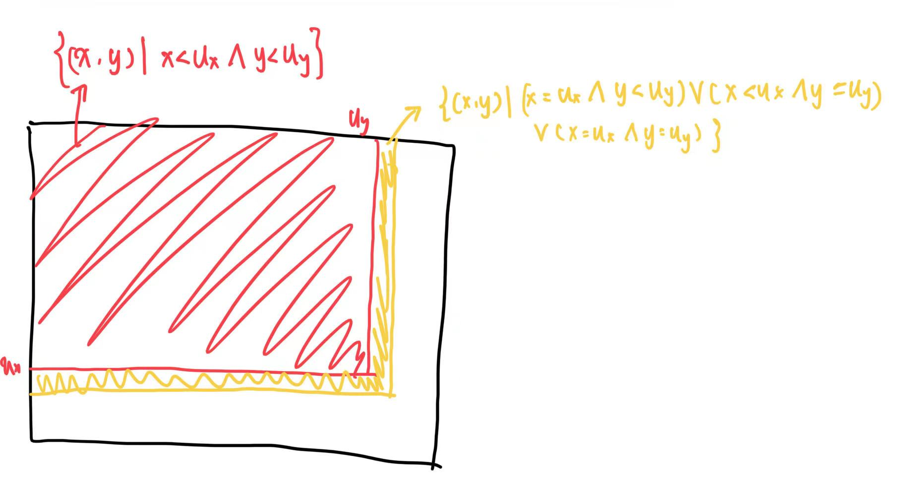

# Report on experiment results (10/07)

## Goal

For two columns $\mathcal{C}_1, \mathcal{C}_2$ in a dataset, given $(l_1, u_1), (l_2, u_2)$, try to estimate:

$$
\mathrm{Card}\left(\{(x, y) \in \mathcal{C}_1 \times \mathcal{C}_2 | l_1 \leqslant x \leqslant u_1 \land l_2 \leqslant y \leqslant u_2\}\right)
$$ 

## Motivation
By using prefix-sum matrix, we can calculate the sum of any given range easily.


To do so, we first have to allocate column values into multiple buckets, thus we can build up the prefix-sum matrix shown above.

## Methods

### Allocate buckets

The total amount of buckets is a hyperparameter, and our intuition is that more bucket should be allocated to the column that contians more distinct values (#DVs).

We use a simple greedy algorithmn:

```cpp
for (int i = 0; i < bits; i++) {
    // Always allocate buckets to the column that needs more
    if (dv1 * 1.0 / bkt1 > dv2 * 1.0 / bkt2) {
        alloc1++;
        bkt1 *= 2;
    } else {
        alloc2++;
        bkt2 *= 2;
    }
}
```

### Quantization

We decide to make every bucket carry the same number of distinct values. (Since that if the number of allocated buckets is more than #DV, then one bucket holds one distinct value is the best method)

```cpp
for (int i = 1; i < val.size(); i++) {
    if (val[i] != val[i - 1]) {
        // The count of #DV
        cnt++;
        // When one bucket holds enough distinct values
        if (std::trunc(cnt * 1.0 / capacity) != id) {
            // open a new bucket
            id++;
            // and the lower bound of a bucket is logged
            // into a look-up table
            lookup.push_back(val[i]);
        }
    }
}
```

Every element $x$ in bucket $\mathcal B_i$ suffices that (except for the last bucket) :

$$
\mathrm{Lookup[i]} \leqslant x < \mathrm{Lookup[i+1]}
$$

We use a simple binary search for finding bucket ID.

### Estimation


Since all values are quantized to bucket ID, we need to quantize the query bounds too. The naive method is to use bucket ID to replace the bounds. 



As shown above, such method can cause great error.

We take the uniform assumption, which suggests that elements in a bucket is uniformly distributed. By accepting the assumption, we can estimate the prefix-sum using float point coordinates.



We denote the prefix-sum function on (discrete) coordinate $(i, j)$ to be $\sum(i, j)$. For any float point number $x$, it can be expressed as $x = p_x + r_x$, where $p_x$ is integer part with $r_x$ to be the remnant. 

As shown above, the prefix-sum of float point coordinates is estimated to be:

$$
\sum_{\mathrm{float}}(x, y) = \sum(p_x, p_y) + r_x(1 - r_y) \sum(p_x + 1, p_y) + r_y(1 - r_x) \sum(p_x, p_y + 1) + r_x r_y \sum(p_x +1, p_y + 1) 
$$

However, applying such assumption still suffers inaccuracy. Even though we take the unifrom assumption, what inside the buckets are still distinct values after all.



This may cause great error when #DV is close to the number of buckets and the query interval is reletively small. We have to estimate the percentage that all elements of a distinct value may take in a bucket.



We simple use $\mathrm{DV} / \mathrm{Buckets}$ to estimate the yellow part of the above figure.

## Results

I tested the algorithm in a dataset with 7 columns of numeric values and 2075259 repectively. 

The full result of the experiment can be seen [here](./result_household_power_consumption.md).

For most situations, the uniform assumption works well and the Q-error is below 2. However, exception has it that it can be worse than the naive method.

Shown below is the results when experimenting on Global_active_power * Sub_metering_1 with bit width = 8.

* Allocated Size: 128 * 2
* Expected Size: 4187 * 89
* Experiment Result:

| Query Lower Bound    | Quantized             | Query Upper Bound     | Quantized             | Estimated Value | Actual Value | Q-Error   |
| :----                | :----                 | :----                 | :----                 | :----           | :----        | :----     |
| (0.118000, 0.000000) | (0.636364, 0.000000)  | (0.524000, 0.000000)  | (6.874321, 0.022472)  | 21292           | 942831       | 44.280998 |
| (0.118000, 0.000000) | (0, 0)                | (0.524000, 0.000000)  | (7, 1)                | 983989          | 942831       | 1.043654  |
| (0.320000, 0.000000) | (3.718750, 0.000000)  | (1.762000, 0.000000)  | (25.788147, 0.022472) | 24652           | 1047092      | 42.474930 |
| (0.320000, 0.000000) | (3, 0)                | (1.762000, 0.000000)  | (26, 1)               | 1276594         | 1047092      | 1.219180  |
| (0.220000, 0.000000) | (2.181818, 0.000000)  | (1.254000, 39.000000) | (18.030571, 0.889139) | 929613          | 1043684      | 1.122708  |
| (0.220000, 0.000000) | (2, 0)                | (1.254000, 39.000000) | (19, 1)               | 1149767         | 1043684      | 1.101643  |
| (0.638000, 0.000000) | (8.575758, 0.000000)  | (1.342000, 0.000000)  | (19.363903, 0.022472) | 6311            | 262340       | 41.568691 |
| (0.638000, 0.000000) | (8, 0)                | (1.342000, 0.000000)  | (20, 1)               | 351131          | 262340       | 1.338458  |
| (0.254000, 0.000000) | (2.696970, 0.000000)  | (1.254000, 0.000000)  | (18.030571, 0.022472) | 20562           | 878324       | 42.715885 |
| (0.254000, 0.000000) | (2, 0)                | (1.254000, 0.000000)  | (19, 1)               | 1149767         | 878324       | 1.309047  |
| (0.256000, 0.000000) | (2.727273, 0.000000)  | (0.352000, 2.000000)  | (4.242692, 0.066916)  | 23679           | 353256       | 14.918535 |
| (0.256000, 0.000000) | (2, 0)                | (0.352000, 2.000000)  | (5, 1)                | 672619          | 353256       | 1.904055  |
| (0.200000, 0.000000) | (1.878788, 0.000000)  | (0.334000, 1.000000)  | (3.968071, 0.044694)  | 22296           | 504664       | 22.634733 |
| (0.200000, 0.000000) | (1, 0)                | (0.334000, 1.000000)  | (4, 1)                | 590265          | 504664       | 1.169620  |
| (0.350000, 0.000000) | (4.181818, 0.000000)  | (3.834000, 0.000000)  | (57.454815, 0.022472) | 29753           | 1183430      | 39.775150 |
| (0.350000, 0.000000) | (4, 0)                | (3.834000, 0.000000)  | (58, 1)               | 1358695         | 1183430      | 1.148099  |
| (1.894000, 0.000000) | (27.781252, 0.000000) | (3.492000, 0.000000)  | (52.242695, 0.022472) | 5684            | 199800       | 35.151302 |
| (1.894000, 0.000000) | (27, 0)               | (3.492000, 0.000000)  | (53, 1)               | 273375          | 199800       | 1.368243  |
| (0.284000, 0.000000) | (3.156250, 0.000000)  | (3.460000, 0.000000)  | (51.749321, 0.022472) | 34383           | 1422029      | 41.358490 |
| (0.284000, 0.000000) | (3, 0)                | (3.460000, 0.000000)  | (52, 1)               | 1569036         | 1422029      | 1.103378  |

Even though having more buckets effectively suppresses q-error, the naive method still performed better.

* Allocated Size: 2048 * 32
* Expected Size: 4187 * 89
* Experiment Result:

| Query Lower Bound    | Quantized              | Query Upper Bound     | Quantized               | Estimated Value | Actual Value | Q-Error  |
| :----                | :----                  | :----                 | :----                   | :----           | :----        | :----    |
| (0.226000, 0.000000) | (36.500000, 0.000000)  | (0.228000, 0.000000)  | (37.489132, 0.359551)   | 6174            | 17387        | 2.816164 |
| (0.226000, 0.000000) | (36, 0)                | (0.228000, 0.000000)  | (38, 1)                 | 34711           | 17387        | 1.996377 |
| (0.340000, 0.000000) | (64.500000, 0.000000)  | (0.932000, 0.000000)  | (209.489136, 0.359551)  | 179165          | 481457       | 2.687227 |
| (0.340000, 0.000000) | (64, 0)                | (0.932000, 0.000000)  | (210, 1)                | 506192          | 481457       | 1.051375 |
| (0.236000, 0.000000) | (39.000000, 0.000000)  | (1.884000, 0.000000)  | (442.489136, 0.359551)  | 520964          | 1383892      | 2.656406 |
| (0.236000, 0.000000) | (39, 0)                | (1.884000, 0.000000)  | (443, 1)                | 1449553         | 1383892      | 1.047447 |
| (1.242000, 0.000000) | (285.000000, 0.000000) | (2.452000, 0.000000)  | (581.489136, 0.359551)  | 219673          | 554248       | 2.523059 |
| (1.242000, 0.000000) | (285, 0)               | (2.452000, 0.000000)  | (582, 1)                | 611359          | 554248       | 1.103042 |
| (0.214000, 0.000000) | (33.500000, 0.000000)  | (3.022000, 0.000000)  | (720.822510, 0.359551)  | 628256          | 1655901      | 2.635711 |
| (0.214000, 0.000000) | (33, 0)                | (3.022000, 0.000000)  | (721, 1)                | 1755026         | 1655901      | 1.059862 |
| (1.390000, 0.000000) | (321.000000, 0.000000) | (1.764000, 0.000000)  | (412.989136, 0.359551)  | 102542          | 257481       | 2.510981 |
| (1.390000, 0.000000) | (321, 0)               | (1.764000, 0.000000)  | (413, 1)                | 285212          | 257481       | 1.107701 |
| (0.426000, 0.000000) | (85.500000, 0.000000)  | (0.982000, 37.000000) | (221.989136, 13.359550) | 293626          | 293571       | 1.000187 |
| (0.426000, 0.000000) | (85, 0)                | (0.982000, 37.000000) | (222, 14)               | 297755          | 293571       | 1.014252 |
| (0.266000, 0.000000) | (46.000000, 0.000000)  | (2.178000, 0.000000)  | (514.489136, 0.359551)  | 507042          | 1336401      | 2.635681 |
| (0.266000, 0.000000) | (46, 0)                | (2.178000, 0.000000)  | (515, 1)                | 1410608         | 1336401      | 1.055527 |
| (0.446000, 0.000000) | (90.333336, 0.000000)  | (1.720000, 0.000000)  | (402.489136, 0.359551)  | 269148          | 698831       | 2.596456 |
| (0.446000, 0.000000) | (90, 0)                | (1.720000, 0.000000)  | (403, 1)                | 752136          | 698831       | 1.076277 |
| (0.218000, 0.000000) | (34.500000, 0.000000)  | (1.446000, 0.000000)  | (335.489136, 0.359551)  | 458433          | 1238240      | 2.701027 |
| (0.218000, 0.000000) | (34, 0)                | (1.446000, 0.000000)  | (336, 1)                | 1287098         | 1238240      | 1.039458 |

It may be caused by extremely unbalanced distribution among distinct values. 

## Discussion

Try making buckets of balanced height (which means they should carry the same number of elements instead of distinct values).